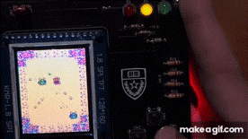
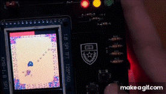
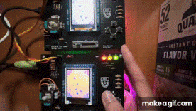

# ECE319K Final Project

A custom top down shooter game inspired by Stardew Valley and written for Texas Instrument's MSPM0G35077 microcontroller using Code Composer Studio. Made with custom PCB and firmware!

Here are some quick clips from the demo:
<table>
  <tr>
    <td></td>
  </tr>
  <tr>
    <td colspan="1" align="center">
      <em><b></b>PvE Swarm</em>
    </td>
  </tr>
</table>
<table>
  <tr>
    <td></td>
  </tr>
  <tr>
    <td colspan="1" align="center">
      <em><b></b>PvE Boss</em>
    </td>
  </tr>
</table>
<table>
  <tr>
    <td></td>
  </tr>
  <tr>
    <td colspan="1" align="center">
      <em><b></b>UART Multiplayer!</em>
    </td>
  </tr>
</table>

Watch the full demo here: https://youtu.be/CLXkbNx_9Yk

Features:
- Custom drivers for graphics, audio, controls, and UART multiplayer
- Singleplayer gamemode
 - Multiple waves of enemies ending with a boss
 - Collectibles and upgrades
 - Point system
- 2 Multiplayer gamemodes
 - Standard PvP
 - Capture the Flag PvP

